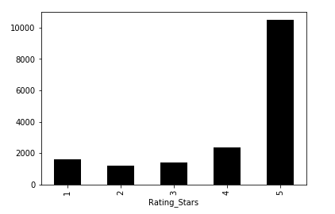
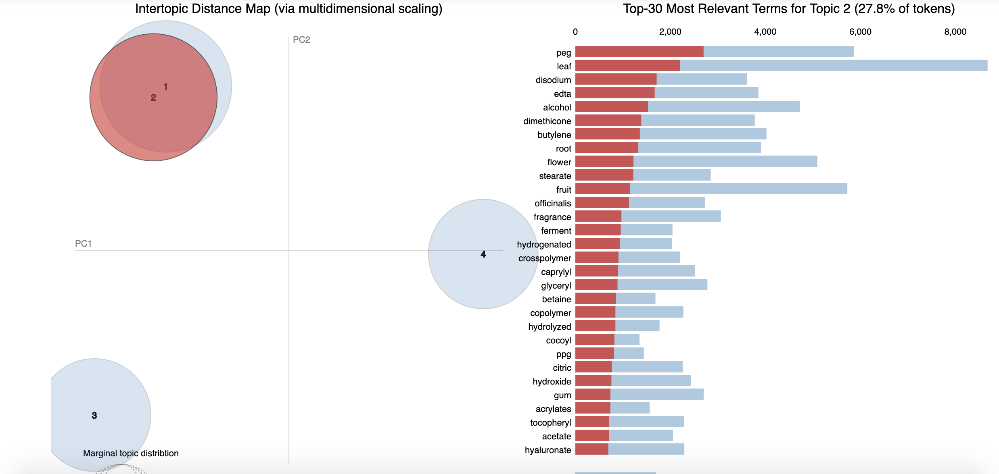
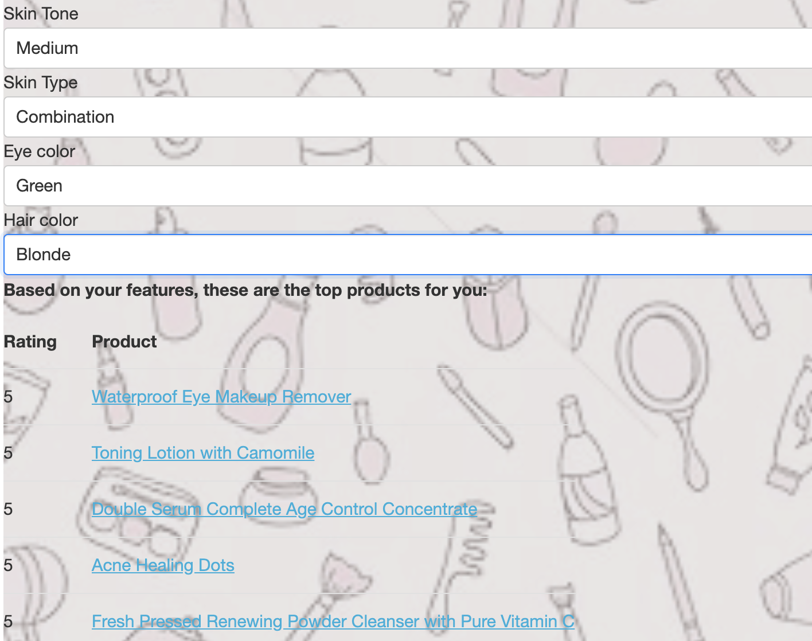
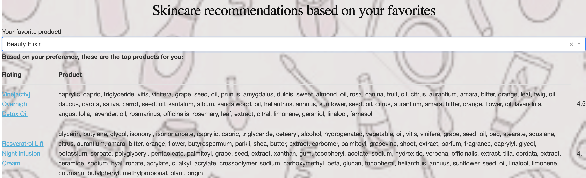
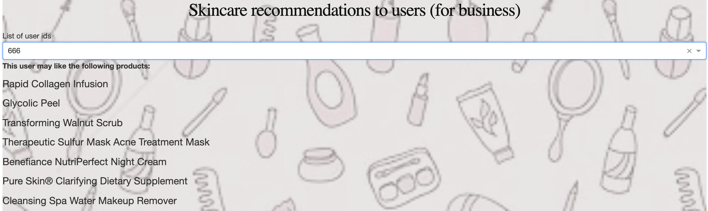

# Skincare recommendations

For the final project I decided to build a recommendation system. I have worked with **Sephora** website before, both as a data scientist and as a regular customer, so I am familiar with the structure of their data and posess some domain knowledge. As far as I know, at the moment Sephora doesn't have a sophisticated recommender: they allow users to filter products based on the notes from the manufacturer. For example, a user can go to the ['beauty quiz'](https://www.sephora.com/beauty/foundation-finder) page, select one of the options (foundation, toner, moisturizer, etc.), specify some details, and get filtered results. However, there is no ingredient analysis behind this algorithm, and no user feature analysis. 

I had many ideas about building a skincare recommendation system. One of them was to analyze **user features**: skin tone, skin type, eye color, and hair color. This is as close as I could get to genetical analysis. Another idea was to use several **NLP** techniques to understand the chemistry of skincare products. I do not have a background in biochemistry, but these techniques would allow me to detect products that have similar ingedients and recommend those to the users who already like one sister-product, but haven't tried another.

After days of exploration I ended up with **three models**: one that recommends products **based on user feature similarity** (if one user shares skin type, tone, eye color, hair color, with another user, there is a chance they will enjoy same products), one that gives **content-based recommendations** (cosine similarity between the chemical compositions of the products), and one **hybrid model**. The last one is best for business use: customer service represintatives can type in a unique user id and get a list of products recommended to that user, which, for example, can be emailed to that customer. 

All three models can be found in a **Dash web app** that I wrote as a final touch.

**A note on data acquisition and feature engineering**: I scraped Sephora.com using selenium webdriver and got two dataframes: user data and product data. They were merged together on unique user id, cleaned, which resulted in a big dataframe with the following columns: 'Username', 'Skin_Tone', 'Skin_Type', 'Eye_Color', 'Hair_Color','Rating_Stars', 'Review', 'Product', 'Brand', 'Price', 'Rating','Ingredients', 'Combination', 'Dry', 'Normal', 'Oily', 'Sensitive','Category', 'Product_Url', 'User_id', 'Product_id','Ingredients_Cleaned', 'Review_Cleaned', 'Good_Stuff', 'Ing_Tfidf'.

**EDA**

As we can see on the graph above, the ratings are unevenly distributed. One may expect to see more balanced ratings, or more 1-star reviews, but in reality, 5-star is a dominant class. This means that Sephora customers mostly write reviews when they are happy with the product. This may cause some problems in building a recommendation system, so the threshold should be 'greater than 4' and '4 or less'. We only want to recommend products that a user will rate with 5 stars.

Wordclouds (positive and negative reviews)

If you carefully look at the wordcloud of the negative reviews, you can see that a lot of people complain about the smell of the skincare product!

**LDA clustering**

**Model 1: Recommender that uses the customer features only to recommend the products**

**Model 2: Recommends products using similarity between their ingredients**

These recommendations actually make a lot of sense. I have tested it on the product that I used and loved, and it spits out the names that I also enjoy!

**Model 3: Hybrid model that compares users**

